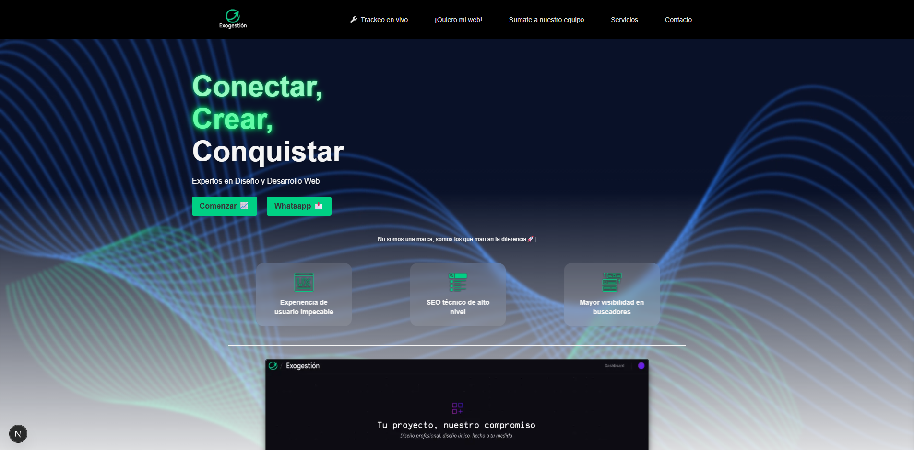
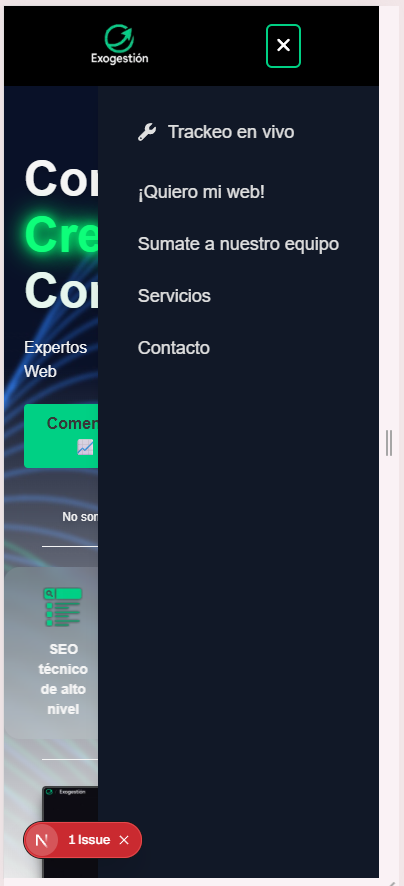
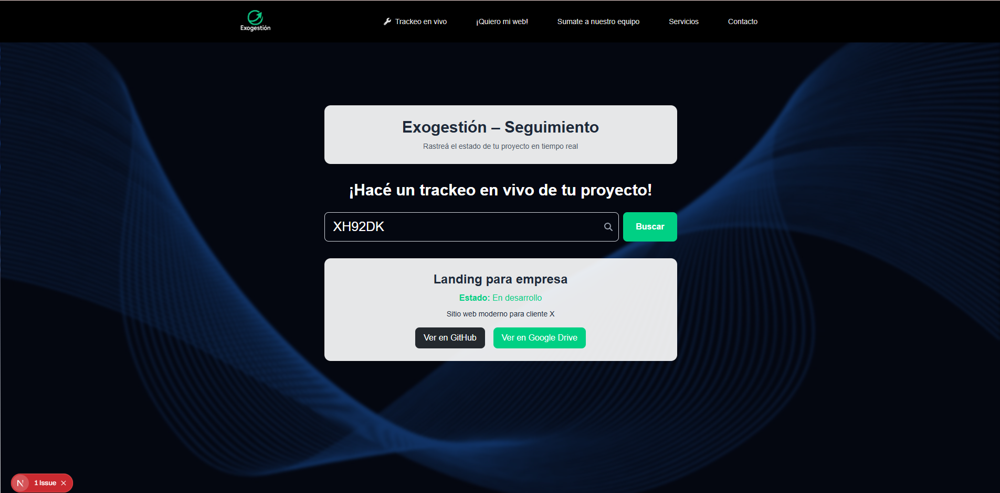
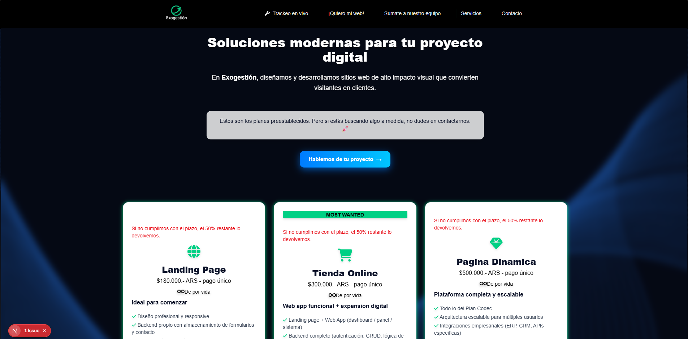

# 🚀 EXOGESTION — Digital Management Platform

**Exogestion** es una plataforma digital creada para posicionar a una agencia de desarrollo con una presencia web moderna, eficaz y profesional. 

Diseñada para captar clientes, gestionar contactos y transmitir solidez de marca, esta app combina diseño, tecnología y rendimiento al máximo nivel. 

Cada línea de código, cada transición y cada componente están pensados para ofrecer **calidad**, **eficiencia** y **experiencia de usuario real**.

---

## 🧠 ¿Qué hace especial a Exogestion?

- 🔥 **App de trackeo propia**, para que el cliente tenga acceso las 24 horas del proyecto y su evolución.
- 🎨 **Branding completo** hecho a medida, cuidando cada detalle visual para lograr coherencia, estética y profesionalismo.
- 🚀 **Resultados excepcionales en Lighthouse**: performance, SEO, accesibilidad y buenas prácticas optimizadas al 100%.
- 🌐 **Arquitectura moderna con Next.js** y su sistema de **App Router**, aprovechando la potencia de su API integrada.
- 📩 **Formulario de contacto funcional** con envío real de mails vía **Nodemailer**.
- 📱 **Diseño responsive**, con navegación fluida y elementos interactivos mediante **SwiperJS**.
- ⚙️ Código profesional con **TypeScript**, **ESLint** y una estructura modular escalable.

---

## 🛠 Tecnologías utilizadas

- **Next.js 13+ (App Router)**
- **TypeScript**
- **Tailwind CSS**
- **SwiperJS**
- **Nodemailer**
- **ESLint**
- **Lighthouse Audit Optimization**

---

## 🔗 Demo en vivo

[https://exogestion.vercel.app](https://exogestion.vercel.app)

---

## 📸 Vista previa

Algunas capturas de pantalla que muestran la interfaz y funcionalidades principales de Exogestion:

## 📬 Contacto

Si querés saber más o tenés alguna consulta, podés escribirme a: [moisespelalle@gmail.com](mailto:moisespelalle@gmail.com)